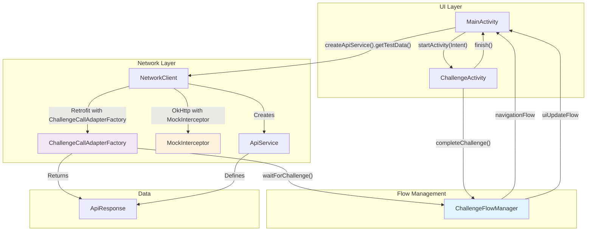
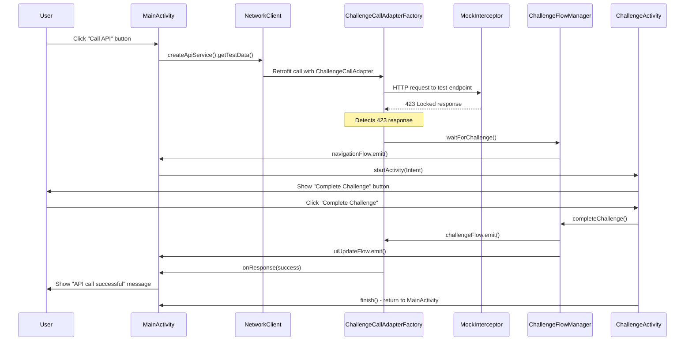

# Challenge Retrofit - Android App

This Android application demonstrates a sophisticated flow control mechanism using Retrofit CallAdapter.Factory, OkHttp interceptors, and Coroutines Flow.

## Architecture Overview

The app implements a unique pattern where:

1. **API calls are intercepted** and mocked to return a 423 (Locked) response
2. **CallAdapter.Factory handles 423 responses** by requesting challenge completion through ChallengeFlowManager
3. **MainActivity listens for navigation events** and launches the challenge screen
4. **Flow-based communication** allows the challenge screen to unlock the API call
5. **Seamless continuation** of the original API call after challenge completion

## Key Components

### 1. MockInterceptor
- Intercepts all API calls to `test-endpoint`
- Returns a mocked 423 response with "Resource locked" message
- Located in: `network/MockInterceptor.kt`

### 2. ChallengeCallAdapterFactory
- Custom Retrofit CallAdapter that handles 423 responses
- Requests challenge completion through ChallengeFlowManager when 423 is received
- Waits for challenge completion signal via Flow before continuing
- Located in: `network/ChallengeCallAdapterFactory.kt`

### 3. ChallengeFlowManager
- Singleton object managing challenge completion mechanism, navigation, and UI state
- Uses Channel-based flow for reliable challenge coordination
- Uses SharedFlow for UI state management and navigation events
- Encapsulates all flow logic away from CallAdapter and activities
- Located in: `flow/ChallengeFlowManager.kt`

### 4. Activities

#### MainActivity
- Contains a button to trigger API calls
- Shows loading state and API response
- Observes UI state changes from ChallengeFlowManager for reactive UI updates
- Listens for navigation events and launches ChallengeActivity when needed

#### ChallengeActivity
- Challenge completion screen
- Contains a button to complete challenge
- Publishes challenge completion signal and returns to MainActivity

## Architecture Diagram



## How It Works



### Step-by-Step Flow:

1. User clicks "Call API" button in MainActivity
2. MockInterceptor returns 423 response
3. ChallengeCallAdapterFactory detects 423 and requests challenge completion via ChallengeFlowManager
4. MainActivity receives navigation event and launches ChallengeActivity
5. User clicks "Complete Challenge" in ChallengeActivity
6. ChallengeFlowManager publishes challenge completion signal
7. CallAdapter receives signal and continues with successful response
8. MainActivity shows success message

## Testing

The app includes unit tests for:
- MockInterceptor returning 423 responses
- ChallengeFlowManager challenge flow communication
- ChallengeFlowManager navigation flow communication

Run tests with:
```bash
./gradlew test
```

## Building and Running

1. Open project in Android Studio
2. Build the project: `./gradlew build`
3. Install on device/emulator: `./gradlew installDebug`
4. Launch the app and test the flow

## Dependencies

- Retrofit 2.9.0 - HTTP client
- OkHttp 4.12.0 - HTTP interceptors
- Kotlinx Coroutines 1.7.3 - Flow and async operations
- AndroidX Activity 1.8.2 - Modern activity handling

## Technical Notes

- Uses `CoroutineScope` with `SupervisorJob` in CallAdapter for proper coroutine management
- Channel-based challenge flow ensures proper event delivery without replay issues
- SharedFlow for navigation events ensures they're not missed by observers
- CallAdapter works with `enqueue()` method (avoids ANR with async handling)
- Thread-safe flow communication between CallAdapter and activities
- Navigation logic is properly encapsulated in ChallengeFlowManager
- MainActivity observes navigation events in lifecycle-aware manner
- Proper state management prevents UI inconsistencies
